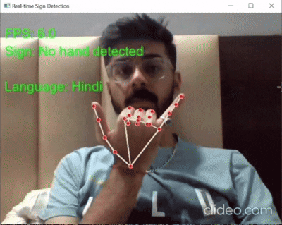

# Real-Time Sign Language Recognition



A real-time sign language recognition system that uses **MediaPipe** for hand keypoint extraction and a **CNN-LSTM** model to recognize signs from video. Recognized signs can be translated into multiple supported languages and converted to speech for real-time interaction.

## Features

- Real-time sign language recognition using a webcam
- Hand landmark detection and normalization using MediaPipe
- CNN-LSTM based sign classification
- Prediction smoothing and confidence filtering for more stable recognition
- Support for **Hindi, Gujarati, Punjabi, and Urdu**
- Translation of recognized signs
- Text-to-speech audio generation and playback
- Automatic and manual audio playback modes
- Model evaluation with classification reports and confusion matrices
- Model versioning and archiving

## Project Structure

```
├── artifacts/          # Model artifacts, encoders, plots, reports, and test data
├── assets/             # Demo video and project presentation
├── config/             # Application, model, language, and path configuration
├── data/               # Videos, processed sequences, translations, audio, and fonts
├── models/             # Current and archived trained models
├── notebook/           # Model training experiments
├── scripts/            # Dataset preparation, training, translation, and setup scripts
├── src/
│   ├── audio/          # Audio generation and playback
│   ├── data/           # Video processing and keypoint extraction
│   ├── input/          # Keyboard input handling
│   ├── model/          # Model architecture, training, and evaluation
│   ├── pipelines/      # Training, evaluation, translation, and recognition pipelines
│   ├── recognition/    # Real-time prediction logic
│   ├── translations/   # Translation utilities and storage
│   └── ui/             # Real-time display and landmark rendering
├── app.py              # Streamlit application
├── requirements.txt    # Python dependencies
└── README.md
```

For a detailed description of individual files, see [file_index.md](file_index.md).

## Project Flow
```text
Raw Videos
    ↓
Video Resizing
    ↓
Keypoint Extraction
    ↓
Sequence Construction
    ↓
Train/Test Split
    ↓
Data Augmentation
    ↓
CNN-LSTM Training
    ↓
Evaluation
    ↓
Saved Model + Encoder
    ↓
Real-Time Camera
    ↓
Prediction → Translation → Audio
```

## Installation

Clone the repository and install the required dependencies:

```
pip install -r requirements.txt
```

Make sure a working webcam is available before running real-time recognition.

## Dataset Preparation

Place the raw sign-language videos inside:

```
data/videos/
```

The videos should be organized by sign/word, for example:

```
data/videos/
├── hello/
├── thank_you/
├── yes/
└── no/
```

Run the project setup script:

```
python scripts/setup_project.py
```

This prepares the videos, generates the training sequences, trains the model, evaluates it, and generates the required translations and audio files.

## Running the Application

After the model and required data have been generated, run:

```
python -m scripts/run_app.py
```

## Model Training

To train the model separately using the prepared dataset:

```
python scripts/train_model.py
```

The training pipeline builds the CNN-LSTM model, trains it, evaluates its performance, and saves the trained model and corresponding label encoder.

## Supported Languages

| Language | Code | Keyboard |
| --- | --- | --- |
| Hindi | `hi` | `H` |
| Gujarati | `gu` | `G` |
| Punjabi | `pa` | `P` |
| Urdu | `ur` | `U` |

## Keyboard Controls

| Key | Action |
| --- | --- |
| `Q` | Quit the application |
| `H` | Switch to Hindi |
| `G` | Switch to Gujarati |
| `P` | Switch to Punjabi |
| `U` | Switch to Urdu |
| `A` | Toggle automatic audio playback |
| `Space` | Manually play audio for the current prediction |

## Notes
- The training dataset is not included in this repository. Users wishing to retrain the model should provide their own compatible video dataset.
- The repository includes a pre-trained model for immediate use. The training pipeline is also provided for users who wish to train the model on their own dataset.
- Translation and audio files are generated in advance to avoid performing translation during real-time recognition.
- The trained model and label encoder are associated through the model version/ID.
- Evaluation results are stored in `artifacts/reports/` and `artifacts/plots/`.

## Future Work
- **Logging**: Add structured logging for better debugging and error tracking.
- **Incremental processing**: Resize only new or failed videos by comparing raw and processed files.
- **Model validation**: Verify model metadata against the data version used for training.
- **Font setup:** Add setup_fonts.py to automate required font setup for multilingual text rendering.
- **Recognition accuracy**: Improve landmark normalization, augmentation, dataset quality, and model performance.
- **Monitoring**: Add better runtime and per-class performance monitoring.
- **API deployment and monitoring:** Develop a FastAPI service for model inference and monitor API performance using metrics such as latency, throughput, and request volume.